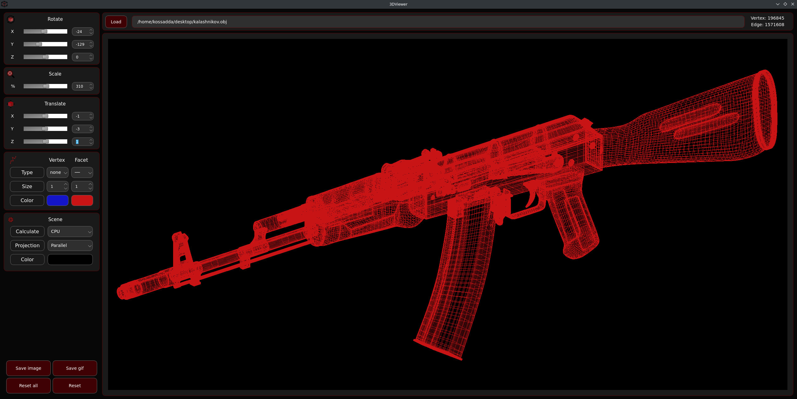
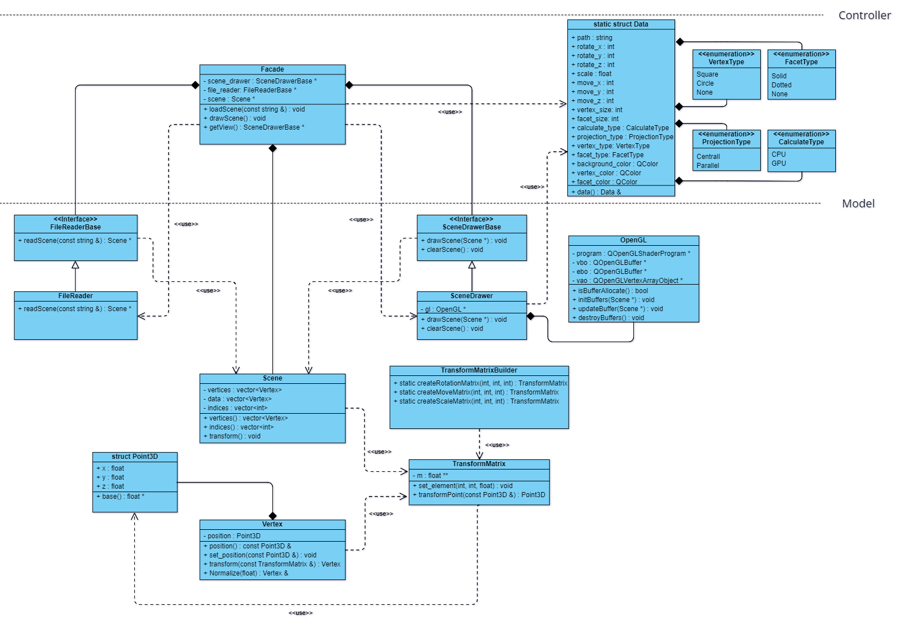

<a id="readme-top"></a>

 | [![Contributors][contributors-shield]][contributors-url] | [![Forks][forks-shield]][forks-url] | [![Stargazers][stars-shield]][stars-url] | [![Issues][issues-shield]][issues-url] | [![MIT License][license-shield]][license-url] | [![LinkedIn][linkedin-shield]][linkedin-url] |
 |:--------------------------------------------------------:|:------------------------------------:|:--------------------------------------:|:--------------------------------------:|:----------------------------------------:|:----------------------------------------:|


<br />
<div align="center">
  <a href="https://github.com/emmonbear/3DViewer">
    
  </a>

  <h3 align="center">3DViewer</h3>

  <p align="center">
    <br />
    <a href="https://github.com/emmonbear/3DViewer"><strong>Изучите документацию »</strong></a>
    <br />
    <br />
    <a href="https://github.com/emmonbear/3DViewer">Посмотреть демо</a>
    /
    <a href="https://github.com/emmonbear/3DViewer/issues/new?labels=bug&template=bug-report---.md">Сообщить об ошибке</a>
    /
    <a href="https://github.com/emmonbear/3DViewer/issues/new?labels=enhancement&template=feature-request---.md">Запросить доработку</a>
  </p>
</div>


<details>
  <summary><strong>Оглавление</strong></summary>
  <ol>
    <li>
      <a href="#о-проекте">О проекте</a>
      <ul>
        <li><a href="#uml-диаграмма-классов">UML диаграмма классов</a></li>
        <li><a href="#собрано-с-помощью">Собрано с помощью</a></li>
      </ul>
    </li>
    <li>
      <a href="#начало-работы">Начало работы</a>
      <ul>
        <li><a href="#необходимое-по">Необходимое ПО</a></li>
        <li><a href="#установка">Установка</a></li>
      </ul>
    </li>
    <li><a href="#участники">Участники</a></li>
    <li><a href="#лицензия">Лицензия</a></li>
    <li><a href="#контакты">Контакты</a></li>
  </ol>
</details>


## О проекте

 <br>

Цель данного проекта состоит в реализации на языке программирования C++ программы для просмотра 3D-моделей в каркасном виде (3D Viewer). Сами модели подгружаются из файлов формата .obj, вследствие чего возможно просматривать их на экране с возможностью вращения, масштабирования и перемещения.

- Программа разработана на языке С стандарта `C++` с использованием компилятора `gcc`. Производится использование дополнительных библиотек и модулей `Qt`;
- Код программы находится в папке `src`;
- Сборка программы и тестов настроена с помощью `CMake`, запуск которого производится при помощи `Makefile` со стандартным набором целей для GNU-программы: `all`, `install`, `uninstall`, `clean`, `dvi`, `dist`, `tests`. Установка ведется в папку `bin` в корне репозитория;
- Программа разработана в соответствии с принципами объектно-ориентированного программирования. Применяются следующие паттерны разработки: `Facade`, `Singleton`, `Strategy`, `MVC`;
- Код написан в соответствии с `Google Style`;
- Обеспечено покрытие `unit`-тестами модулей, связанных с загрузкой моделей и аффинными преобразованиями;
- В один момент времени программа отображает только одну модель на экране;
- Программа предоставляет возможность:
    - Загружать каркасную модель из файла формата `obj` (поддержка только списка вершин и поверхностей);
    - Перемещать модель на заданное расстояние относительно осей `X`, `Y`, `Z`;
    - Поворачивать модель на заданный угол относительно своих осей `X`, `Y`, `Z`;
    - Масштабировать модель на заданное значение;
    - Производить афинные преобразования с использованием процессора/видеопамяти;
    - Настраивать тип проекции (параллельная и центральная);
    - Настраивать для ребер тип (отсутствуют, сплошная, пунктирная), цвет и толщину;
    - Настраивать для вершин тип (отсутствуют, круг, квадрат), цвет и размер;
    - Выбирать цвет фона;
    - Cохранять полученные («отрендеренные») изображения в файл в форматах `bmp` и `jpeg`;
    - Записывать небольшие «скринкасты» - текущие пользовательские аффинные преобразования загруженного объекта в `gif`-анимацию (640x480, 10`fps`, 5s);
- В программе реализован графический пользовательский интерфейс, на базе GUI-библиотек `QT` с `API` для `C++`.
- Графический пользовательский интерфейс содержит:
    - Кнопку для выбора файла с моделью и поле для ввода/вывода его названия;
    - Кнопку переключения метода афинного преобразования (процессор/видекарта);
    - Кнопку переключения проекции;
    - Кнопки выбора типа, цвета и толщины ребер;
    - Кнопки выбора типа, цвета и размера вершин;
    - Кнопку выбора фона;
    - Кнопки сохранения изображения и скринкаста;
    - Зону визуализации каркасной модели;
    - Слайдеры и поля ввода для перемещения модели;
    - Слайдеры и поля ввода для поворота модели;
    - Слайдер и поле ввода для масштабирования модели;  
    - Информацию о загруженной модели - название файла, кол-во вершин и ребер.
- Настройки сохраняется между перезапусками программы;
- Класс реализовани внутри пространства имен `s21`;


### UML диаграмма классов

 <br>


<p align="right">(<a href="#readme-top">наверх</a>)</p>

### Собрано с помощью

<p align="center">
  <p>
    <a href="https://www.cplusplus.com/">
      
    </a>
    <a href="https://cmake.org/">
      
    </a>
    <a href="https://www.qt.io/">
      
    </a>
    <a href="https://www.opengl.org/">
      
    </a>
  </p>
</p>

<p align="right">(<a href="#readme-top">наверх</a>)</p>


## Начало работы

Чтобы получить локальную копию и запустить ее, выполните следующие шаги.

### Необходимое ПО

* CMake
  ```
  sudo apt install cmake
  ```

* Qt
  ```
  sudo apt install qt6-base-dev
  ```

* OpenGL
  ```
  sudo apt-get install build-essential libgl1-mesa-dev
  ```

### Установка

1. Установите необходимое ПО (если отсутствует)
2. Склонируйте репозиторий
    ```sh
    git clone git@github.com:emmonbear/3DViewer.git
    ```
3. Запустите программу установки
    ```sh
    make install
    ```
4. Запустите программу вручную (`3DViewer/bin/viewer`) или введите команду
    ```
    make run
    ```

<p align="right">(<a href="#readme-top">наверх</a>)</p>


## Участники:

<a href="https://github.com/emmonbear/3DViewer/graphs/contributors">
  
</a>

<p align="right">(<a href="#readme-top">наверх</a>)</p>


## Лицензия

Распространяется по лицензии MIT. Смотрите `LICENSE.txt` для получения дополнительной информации.

<p align="right">(<a href="#readme-top">наверх</a>)</p>


## Контакты

Первин Габилов - [Telegram](https://t.me/kossadda) / [e-mail](gabiov1997@gmail.com)

Илья Москалев  - [Telegram](https://t.me/emmonbea) / [e-mail](moskaleviluak@icloud.com)

<p align="right">(<a href="#readme-top">наверх</a>)</p>


<!-- ССЫЛКИ И ИЗОБРАЖЕНИЯ MARKDOWN -->
[contributors-shield]: https://img.shields.io/github/contributors/emmonbear/3DViewer.svg?style=for-the-badge
[contributors-url]: https://github.com/emmonbear/3DViewer/graphs/contributors
[forks-shield]: https://img.shields.io/github/forks/emmonbear/3DViewer.svg?style=for-the-badge
[forks-url]: https://github.com/emmonbear/3DViewer/network/members
[stars-shield]: https://img.shields.io/github/stars/emmonbear/3DViewer.svg?style=for-the-badge
[stars-url]: https://github.com/emmonbear/3DViewer/stargazers
[issues-shield]: https://img.shields.io/github/issues/emmonbear/3DViewer.svg?style=for-the-badge
[issues-url]: https://github.com/emmonbear/3DViewer/issues
[license-shield]: https://img.shields.io/github/license/emmonbear/3DViewer.svg?style=for-the-badge
[license-url]: https://github.com/emmonbear/3DViewer/blob/master/LICENSE.txt
[linkedin-shield]: https://img.shields.io/badge/-LinkedIn-black.svg?style=for-the-badge&logo=linkedin&colorB=555
[linkedin-url]: https://linkedin.com/in/othneildrew
